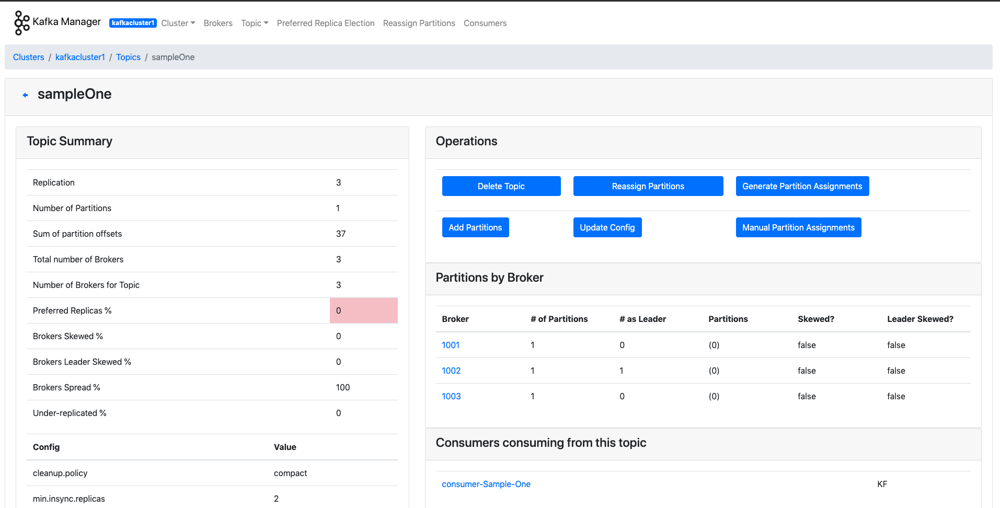
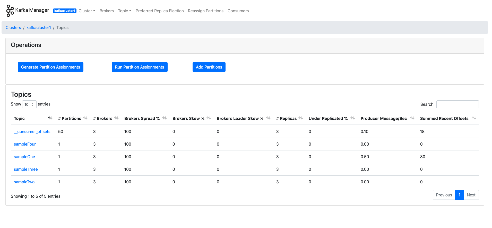
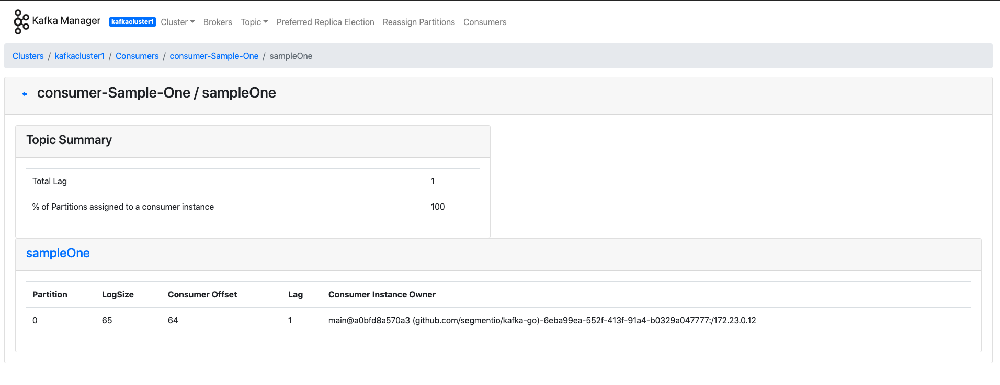

# Instigator
A simple push/pull project that demonstrates the use of kafka for streaming data between two services i.e. a producer and a consumer.

### Docker
To develop and/or run this application, download and install [docker](https://www.docker.com/get-started) and [docker-compose](https://docs.docker.com/compose/install/) from their website before proceeding.

### Scripts
`./scripts/populate_broker.sh`
This will populate the kafka cluster with dummy topics, these topics are referenced by the producer and the consumer, well not all the topics though. Just the topic called `SampleOne`


### Quickstart
Run the command below and grab a cup  of coffee... This will take care of all the hassle in one command.

```
$./scripts/quick_start.sh
```

###Step-by-step build

```
$docker-compose build
```
```
$./scripts/populate_broker.sh
```

Enable JMX exporter for Kafka Manager before starting application.
```
JMX_PORT=9999 docker-compose up
```

Allow 30~ seconds for everything to stabilize. Expect a ton of log spam until then.


### Stop Docker
`docker-compose down` or `CMD/ctrl + C` to stop the application.
I prefer `docker-compose down` as it stops all running containers and removes the underlying default network.


### Working with topics
Ensure brokers are running. After that, execute a variation of the following command.
```
docker exec instigator_broker_1 kafka-topics.sh \
  --create \
  --zookeeper zoo3:2181 \
  --topic testing \
  --replication-factor 3 \
  --partitions 1 \
  --config min.insync.replicas=2 \
  --config cleanup.policy=compact
```

When creating a topic, you should stick to `--replication-factor 3` unless you have an explicit
reason to use less replication. You cannot use a value greater than 3, as there are only 3 brokers.
To learn more about replication, see the [docs](https://kafka.apache.org/documentation/#replication).


## Services

The application consists of the following services:

- Zookeeper ensemble (3 nodes)
- Kafka Broker cluster(3 nodes)
- Python Producer
- Go Consumer
- Kafka-manager
- Burrow

These services are coupled together using the `docker-compose.yml` file at the **root** of the application.

### Brief context:
Kafka relies on Zookeeper to work as zookeeper stores a couple of things like kafka's brokers metadata, Topics metadata, Consumers metadata and partition offset? a question mark there because recent versions of Kafka allows for this to be stored on the kafka cluster as well.

### Zookeeper Ensemble:
Ideally, this replication mode should not be deployed on the same physical machine but let's allow this for development and for proof of concept.
Reference: https://hub.docker.com/_/zookeeper,


#### Zookeeper:
It comes with an admin server enabled by default
http://localhost:{8080-8082}/commands/{stats} where `stat` can be any of the following
e.g. http://localhost:8081/commands/dirs, http://localhost:8080/commands/stats

Here we are checking two different nodes on the zookeeper ensemble. Zookeeper runs on port `{2181 - 2183}` on the host machine but on port `2181` on the docker containers to avoid port collision as we can't re-use ports.

```
configuration
connection_stat_reset
connections
dirs
dump
environment
get_trace_mask
is_read_only
monitor
ruok
server_stats
set_trace_mask
stat_reset
stats
watch_summary
watches
watches_by_path
```

#### Kafka Brokers:
Runs on port `{9092-9094}`on the local machines and on port `9092` for the containers, it uses the `KAFKA_ZOOKEEPER_CONNECT=zoo1:2181,zoo2:2181,zoo3:2181` env variable to send it's metadata to the zookeeper ensemble before operations begins.

#### Kafka-Manager:
This runs on port `9000`, http://localhost:9000, this gives you access to the `kafka-manager` admin UI where you can create a cluster and monitor the activities of your cluster in realtime while performing admistrative task on your cluster to optimize performance.

For this setup add this line `zoo1:2181,zoo2:2181,zoo3:2181` to the cluster host field when you need to create a cluster from the UI dashboard.
```
Username: admin
password: admin
```

#### Python Producer
 A simple python http server written using the flask framework to simulate a producer for our kafka cluster. It runs on port `5000` http://localhost:5000

It also comes with the following routes to start producing and to stop producing
```
http://localhost:5000/
http://localhost:5000/start_producer
http://localhost:5000/stop_producer
```

#### Go Consumer
 A simple Golang http server written to simulate a consumer for our kafka cluster. It runs on port `5001` http://localhost:5001

It also comes with the following routes to start consuming and to stop consuming **(dummy route)**
- To stop consuming simply use the `http://localhost:5000/stop_producer` route, that way the consumer will naturally stop consuming data

```
http://localhost:5001/
http://localhost:5001/start_consumer
http://localhost:5001/stop_consumer
```

#### Burrow
Burrow allows us to monitor consumer lag. The evaluation rules used can be found from this [link](https://github.com/linkedin/Burrow/wiki/Consumer-Lag-Evaluation-Rules). Burrow logs everything in `burrow/log`.

You can find the cluster list via `http://localhost:8000/v3/kafka`. See [Request Endpoints](https://github.com/linkedin/Burrow/wiki/HTTP-Endpoint#request-endpoints) for an overview
of Burrow's REST API.

**Configuring**
Burrow is configured via `burrow/burrow-config/burrow.toml`. If you make changes to this config,
you will need to restart Burrow. Do not change the ZooKeeper and Kafka broker hostnames. See
[Configuration](https://github.com/linkedin/Burrow/wiki/Configuration) for configuration details.


#### Kafka-manager-pix






